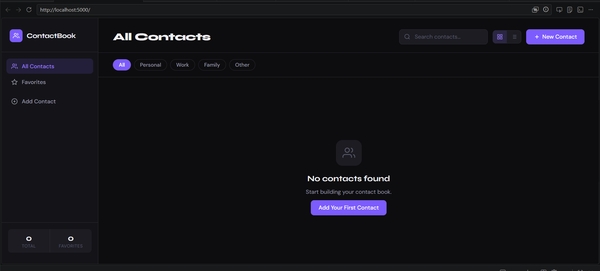
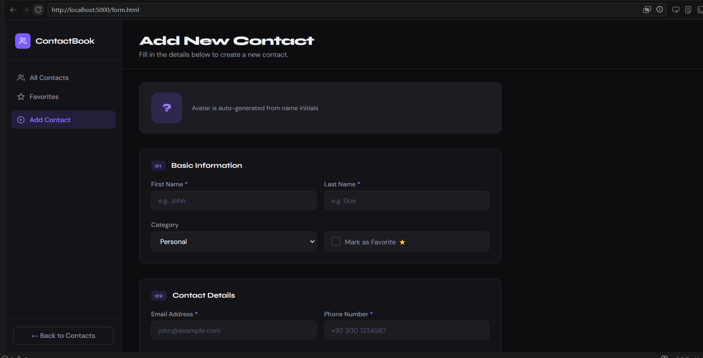
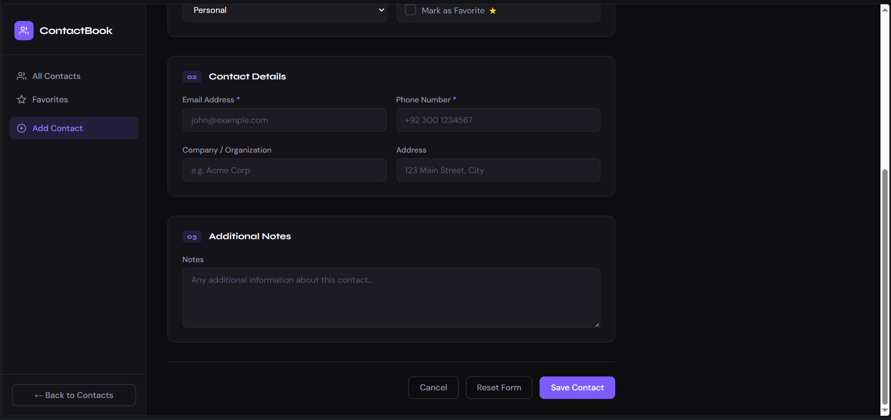
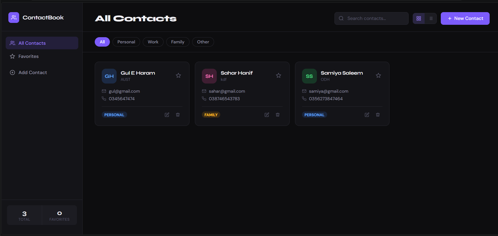
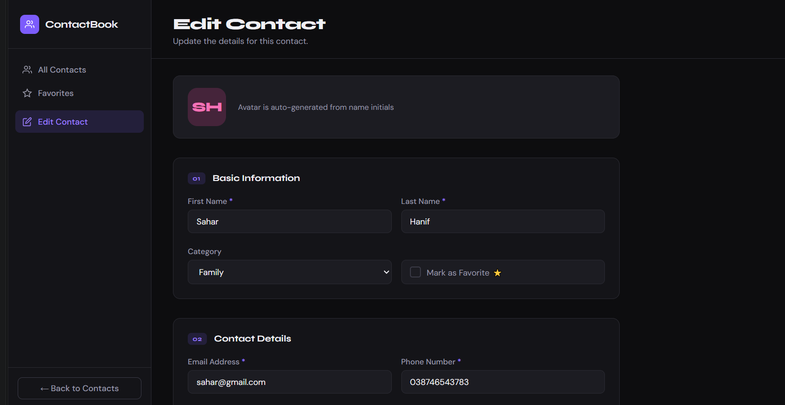

#  ContactBook

A full-stack Contact Book application built with **ASP.NET Core 8**, **MongoDB**, and vanilla **HTML/CSS/JavaScript**. Supports full CRUD operations via a RESTful API.

---

##  Screenshots

| Main Page (All Contacts) | Add / Edit Contact | View / Operations |
|---|---|---|
|  |  |  |
|  |  |  |

---

##  Tech Stack

| Layer | Technology |
|---|---|
| Frontend | HTML5, CSS3, Vanilla JavaScript |
| Backend | ASP.NET Core 8 Web API (C#) |
| Database | MongoDB |
| API Docs | Swagger / OpenAPI |

---

## Features

- **GET** — Fetch and display all contacts from MongoDB
- **POST** — Add a new contact with form validation
- **PUT** — Edit/update an existing contact
- **DELETE** — Remove a contact with confirmation dialog
- **PATCH** — Toggle favorite status
- **Search** — Real-time client-side search + server-side search endpoint
- **Category Filter** — Filter by Personal / Work / Family / Other
- **Favorites** — Star contacts and view favorites separately
- **Grid / List View** — Toggle between card grid and list layout
- **Form Validation** — Client-side validation before every submission
- **Toast Notifications** — Success/error feedback on all actions
- **Swagger UI** — Interactive API docs at `/swagger`

---

##  Setup Instructions

### Prerequisites

Make sure you have installed:

1. [.NET 8 SDK](https://dotnet.microsoft.com/en-us/download/dotnet/8.0)
2. [MongoDB Community Server](https://www.mongodb.com/try/download/community) (local) **or** a [MongoDB Atlas](https://www.mongodb.com/atlas) free cluster

---

### 1. Clone the Repository

```bash
git clone https://github.com/YOUR_USERNAME/ContactBook.git
cd ContactBook
```

---

### 2. Configure MongoDB Connection

Open `ContactBook.API/appsettings.json` and update the connection string:

**Option A — Local MongoDB (default):**
```json
{
  "MongoDbSettings": {
    "ConnectionString": "mongodb://localhost:27017",
    "DatabaseName": "ContactBookDB",
    "ContactsCollectionName": "Contacts"
  }
}
```


---

### 3. Start MongoDB (if running locally)

**Windows:**
```bash
net start MongoDB
`
```

---

### 4. Restore & Run the Backend

```bash
cd ContactBook.API
dotnet restore
dotnet run
```

The API will start at **`https://localhost:5001`** (or `http://localhost:5000`).

---

### 5. Open the Frontend

Since the frontend is served as static files from the ASP.NET Core project, simply open your browser:

```
https://localhost:5001
```

- **Main Page:** `https://localhost:5001/index.html` — View all contacts
- **Add Contact:** `https://localhost:5001/form.html` — Add a new contact
- **Edit Contact:** `https://localhost:5001/form.html?id=<contactId>` — Edit existing
- **API Docs:** `https://localhost:5001/swagger` — Interactive Swagger UI

> ⚠️ If your browser warns about the self-signed SSL cert in development, click "Advanced → Proceed".  
> You can also run with `dotnet run --urls http://localhost:5000` to use HTTP only.

---

## 📁 Project Structure

```
ContactBook/
├── ContactBook.API/               # ASP.NET Core backend
│   ├── Controllers/
│   │   └── ContactsController.cs  # REST API endpoints
│   ├── DTOs/
│   │   └── ContactDtos.cs         # Request/response data transfer objects
│   ├── Models/
│   │   ├── Contact.cs             # MongoDB document model
│   │   └── MongoDbSettings.cs     # Config POCO
│   ├── Services/
│   │   └── ContactsService.cs     # Business logic + MongoDB operations
│   ├── wwwroot/                   # Frontend (served as static files)
│   │   ├── index.html             # Page 1: All Contacts
│   │   ├── form.html              # Page 2: Add / Edit Contact
│   │   ├── css/
│   │   │   └── style.css
│   │   └── js/
│   │       ├── api.js             # REST API client
│   │       ├── main.js            # Main page logic
│   │       └── form.js            # Form page logic
│   ├── appsettings.json
│   ├── appsettings.Development.json
│   └── ContactBook.API.csproj
└── README.md
```

---

## 🔌 API Endpoints

| Method | Endpoint | Description |
|---|---|---|
| `GET` | `/api/contacts` | Get all contacts |
| `GET` | `/api/contacts/{id}` | Get contact by ID |
| `GET` | `/api/contacts/search?q={query}` | Search contacts |
| `POST` | `/api/contacts` | Create new contact |
| `PUT` | `/api/contacts/{id}` | Update contact |
| `DELETE` | `/api/contacts/{id}` | Delete contact |
| `PATCH` | `/api/contacts/{id}/favorite` | Toggle favorite |

All responses follow the format:
```json
{
  "success": true,
  "message": "...",
  "data": { ... }
}
```

---

##  Development Notes

- The database and collection are created automatically on first run.
- An email uniqueness index is created automatically.
- Form validation runs both client-side (JS) and server-side (ASP.NET Data Annotations).
- CORS is set to allow all origins — restrict this for production.

---

##  Author

**Syeda Mehrunnisa **  
Roll No: 2502133
Course: Web technologies
Instructor:Mam Warda
